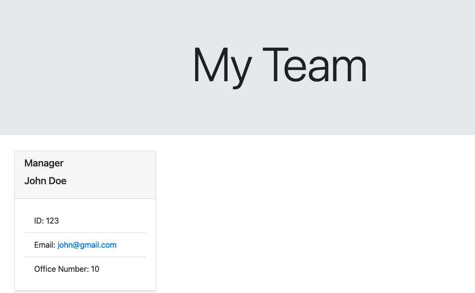

# Team Profile Generator

### Languages and Tools:

 
 
 

 

 

---
  ## Description
  This is a command-line application that takes in information about employees on a software engineering team, then generates an HTML webpage that displays summaries for each person. This project was also created, in part, to demonstrate my ability to work with JavaScript, HTML, Node.js, various NPM packages, Command line interface (CLI), and JEST testing.
## Table of Contents 
  * [Installation](#installation)
  * [Usage](#usage)
  * [Tests](#tests)
  * [Questions](#questions)
  ## Installation 
  Clone my code and run it in Terminal with Node.js
  ## Usage 
  This app generates web pages with information about employees.
  ## Tests
  JEST tests for all code passed successfully.
  ## Questions? 
  Contact me through: https://github.com/spclk

  Here's a link to my tutorial video:
  [Video](https://drive.google.com/file/d/1PqxUW185r3zA9wLl6Ue2tT5UCuLf38kA/view)

  And here's a screenshot:
  
